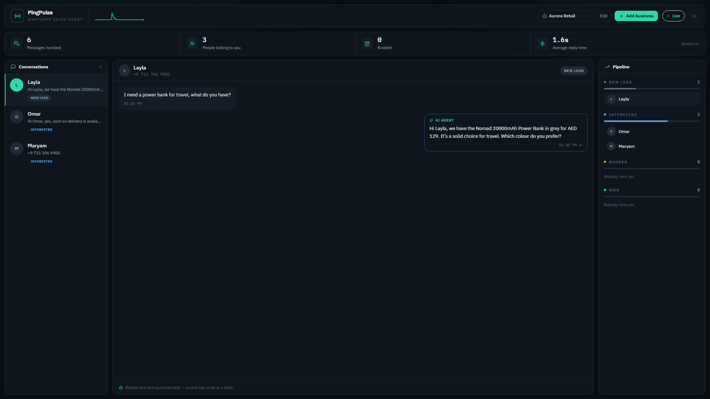
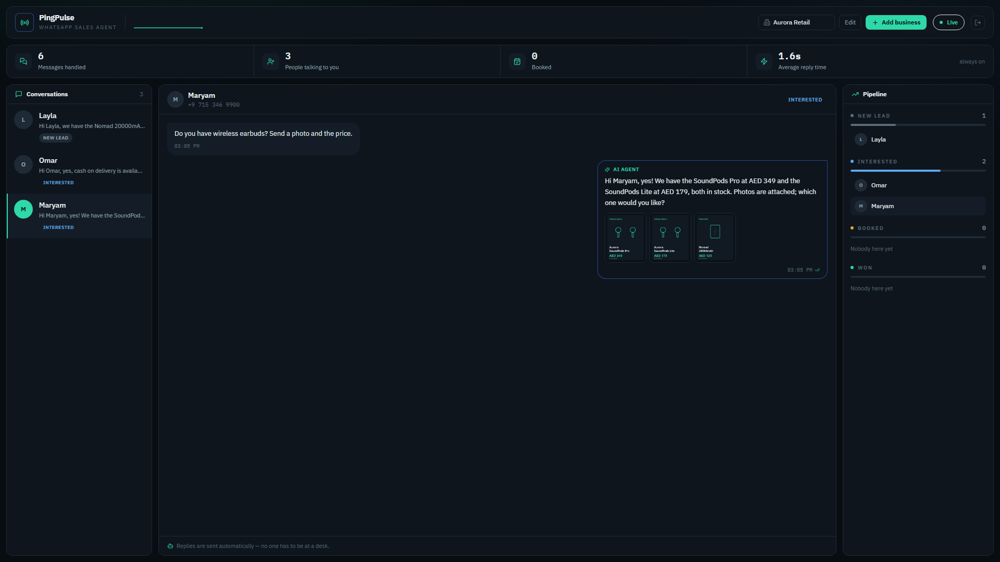
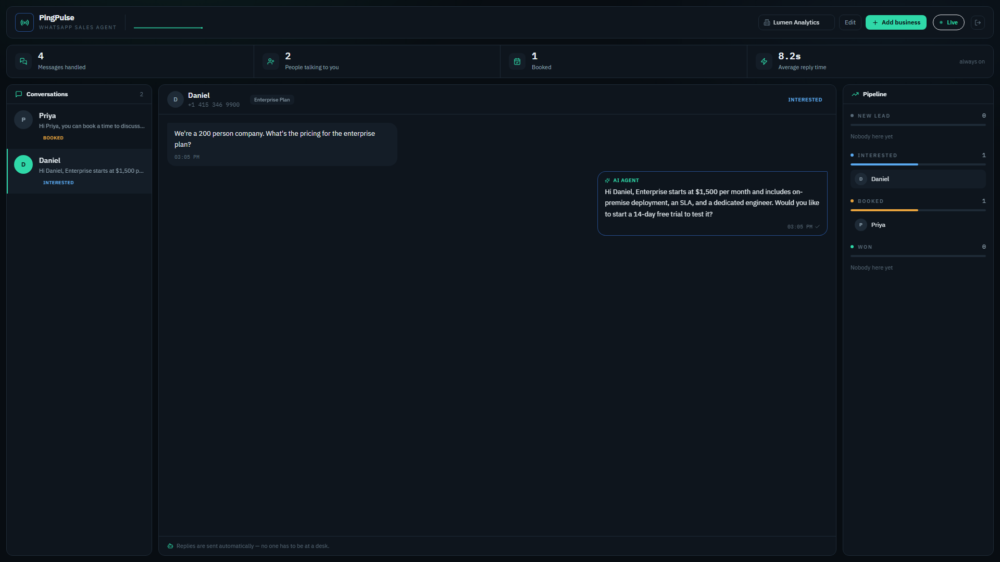
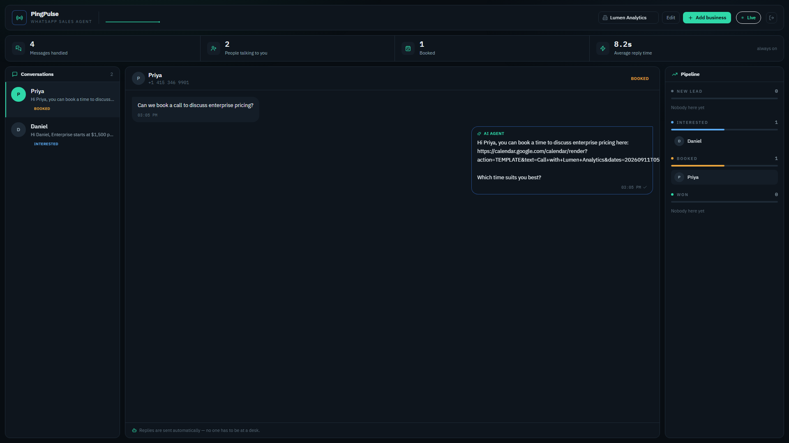

# PingPulse — Client Overview & Upgrade

**The definitive overview of the PingPulse AI Sales Engine**
Document version 2.0 · 10 September 2026 · Supersedes all earlier architecture and guide documents

---

## 1. Executive Overview

PingPulse is an end-to-end, multi-tenant AI sales engine that answers your customers on
WhatsApp, qualifies them, shows them products, remembers what they want, and books calls
into your calendar — without anyone sitting at a desk.

This document replaces the earlier architecture and memory-guide papers. Those described a
backend engine: a prompt pipeline, a database schema, and a plan. What exists now is a
running product with an operator dashboard, a live CRM, computer vision, structured customer
memory, a booking engine and per-tenant isolation. The gap between the two is worth stating
plainly.

### How far this has come

| Area | Earlier documents | PingPulse today |
| --- | --- | --- |
| Scope | Backend engine and prompt pipeline | End-to-end product: dashboard, CRM, agent, booking |
| Tenancy | Single business | Multi-tenant — unlimited businesses under one login, fully isolated |
| Industry | One vertical, hard-coded | Any industry — behaviour comes from your data, not our code |
| Understanding | One prompt, one pass | Two-pass: a strict analyzer reads intent, then a generator answers |
| Memory | Chat history window | Structured memory with sources and confidence, plus rejection tracking |
| Media | Text replies | Inbound photo analysis and outbound product cards |
| Meetings | "A colleague will follow up" | Direct calendar booking links, sent instantly |
| Follow-ups | Manual | Automatic, cancelled the moment the customer replies |
| Delivery | Code you would host | Full-service setup, including your company profile and website |

### The turnkey proposition

PingPulse is no longer something you integrate. It is something we stand up for you. You
bring your provider keys; we build the profile, the catalogue, the website, the routing and
the automation around them.

> **Full-service package.** Alongside the core PingPulse AI integration, we build your
> complete company profile **and** a dedicated custom website tailored to your business.

---

## 2. Built for any industry

PingPulse has been proven end to end on two deliberately opposite businesses — a retail
e-commerce store selling physical stock in dirhams, and a B2B SaaS company selling monthly
seats in dollars. **Those were the two we ran, not the two it supports.**

Nothing about the engine is written for a particular trade. The agent has no built-in idea of
what a product is. Everything it knows — what you sell, what it costs, what your delivery and
payment terms are, how you speak to customers — is read from your organisation's own records
at the moment it answers. Change the records and you change the business it operates.

That makes it equally at home in:

| | |
| --- | --- |
| **Retail & e-commerce** — stock, sizes, delivery windows, cash on delivery | **Real estate** — listings, viewings, budgets, area preferences |
| **B2B SaaS** — tiers, seats, trials, demos | **Healthcare & clinics** — services, availability, appointment booking |
| **Automotive** — models, variants, test drives, finance | **Education & training** — courses, intakes, fees, enrolment calls |
| **Travel & hospitality** — packages, dates, rooms, quotes | **Professional services** — scope, consultations, retainers |
| **Fashion & apparel** — colours, fabrics, sizing, lookbooks | **Fitness & wellness** — memberships, classes, trials |
| **Beauty & salons** — treatments, slots, stylists | **Events & catering** — packages, headcounts, site visits |

Two things carry across all of them: a customer asking questions that deserve a fast, accurate
answer, and a business that loses money when nobody replies. Those are the problems PingPulse
solves — and neither is specific to an industry.

If your sector is not listed, that is not a gap. It is a configuration.

---

## 3. Run every business you own from one login

The multi-tenancy is not an internal detail — it is a feature you get to use.

A single client account can operate **any number of separate businesses**. Each one is a
distinct organisation with its own:

- WhatsApp number and Twilio sender
- Product catalogue, pricing and stock
- Knowledge base, policies and FAQs
- Currency, language and tone of voice
- CRM pipeline, contacts and conversation history
- Team members and their roles

You switch between them from a dropdown in the dashboard. The data does not mix — isolation
is enforced at the database query level, so a request for another organisation's record
returns *not found*, because as far as that session is concerned it does not exist.

> **Adding another business is easy — and we do it for you.** Open a second venture, acquire a
> brand, or launch a different product line, and we provision the new organisation, ingest its
> catalogue, bind its number and configure its CRM. You keep one login and one dashboard.

This is how a group with a retail arm and a services arm, or a franchise owner with several
outlets, runs everything from one screen without the businesses ever seeing each other's
customers.

---

## 4. Bring Your Own Keys — the rest is on us

You stay in control of your own accounts, your own billing, and your own customer data. You
own the keys; we do the work around them.

### What you provide

| Credential | Purpose |
| --- | --- |
| Twilio Account SID | Identifies your WhatsApp account |
| Twilio Auth Token | Authorises sending on your behalf |
| Twilio WhatsApp sender number | The number your customers message |
| Groq API key | Primary language model |
| Gemini API key | Fallback model and image understanding |

Keys are stored per organisation. Your messages are sent from your Twilio account and your
model usage is billed to your provider account — never pooled with anyone else's. Supplying
only half a credential set never silently falls back to ours.

### What we build for you

- **Company profile provisioning.** Your business rules, tone of voice, currency, language,
  delivery terms and payment terms, written into the agent's operating instructions.
- **A dedicated custom website**, designed for your business and integrated with PingPulse.
- **Knowledge base and catalogue ingestion.** Your products, policies and FAQs indexed for
  hybrid retrieval, so the agent quotes real prices and never invents one.
- **Webhook routing and number binding**, so inbound messages reach the right organisation.
- **Isolated database setup and CRM configuration** — your leads, your pipeline, visible only
  to you.
- **Automated follow-up sequences** on background workers.
- **Ongoing tuning** as you send us real conversations.

---

## 5. Multilingual by design

PingPulse detects the language of each incoming message and replies in kind, **per message**,
not per account. The same shop can serve an English customer and an Arabic customer within the
same hour, and each gets an answer in their own language.

Languages configured out of the box include English, Arabic, Urdu, Hindi, Spanish, French,
German, Portuguese, Turkish, Chinese, Indonesian and Malay — and the list is a configuration
file, not a limit.

> **A note on the examples.** Our demonstrations often use Urdu and Roman Urdu, because that is
> where the product was first proven in the field. This is an illustration, not a boundary. The
> engine is not built around Urdu — it adapts across dozens of languages depending on your
> market, and it handles romanised and regional dialects rather than only formal script. Your
> deployment is configured for the languages your customers actually type in.

---

## 6. What the agent actually does

### Understands before it answers

Every message goes through a strict analyzer before anything is said. It returns structured
data — intent, sales stage, colour, size, city, budget, objection, rejections, whether they
want pictures, whether they want a call — and that result decides what gets retrieved and what
the reply is instructed to do. The generator never has to guess what the customer meant.

Eleven intents are classified, including product, price, delivery, payment, image request,
objection, purchase and call booking.

### Tracks the sale through eight stages

`NEW → DISCOVERY → QUALIFIED → PRESENTATION → OBJECTION → NEGOTIATION → READY_TO_BUY → CLOSED`

Stages only move forward — a customer asking a casual question after agreeing to buy has not
become a cold lead again. These roll up automatically to a four-column CRM board
(**Lead → Qualified → Demo Booked → Closed**) that updates live as conversations happen.

### Remembers, with sources

Facts are stored per contact — budget, size, city, colour, category, occasion — each recorded
with where it came from and how confident we are, so something the customer stated outranks
something inferred. Requirements they withdraw are marked inactive rather than deleted, so
"forget X, I want Y" does not lose the fact that X was once wanted.

This memory outlives the chat window. The agent will not ask for a size it was told an hour
ago.

### Never re-offers something rejected

When a customer says they do not want something, it is recorded as a rejection. Rejected
colours and items are filtered out of every later suggestion. "I don't like red, show me blue"
means blue from then on — and red never comes back.

### Reads photos

A customer can send a picture instead of describing what they want. PingPulse extracts colour,
pattern and product category and answers with what it can see, rather than asking them to
describe the image they just sent. When the read is uncertain the agent confirms rather than
asserts, and a photo is never silently ignored.

### Sends products, not descriptions

Matching items are attached to the reply as media, with the name and exact price in the text
beside them. Colour is a hard filter, not a suggestion — a customer who asks for red is never
shown blue because the search scored it nearby.

### Books calls instantly

An explicit request for a call, demo or meeting is detected as its own intent and outranks
everything else. The agent replies immediately with a real booking link (Cal.com or Google
Calendar) and asks which time suits. On that turn it is prohibited from sending product
listings, prices, FAQs or store policies — a booking request gets a booking link, not a
catalogue.

### Never promises a human will call back

"Our team will get back to you" is blocked outright. The agent answers now, with what it has,
or says plainly what it does not know and offers the closest thing it does.

### Quotes only real prices

Every generated reply is checked against your actual catalogue before it is sent. A figure
that does not appear in your price list is rejected and regenerated. A made-up price is a
commitment you would have to honour, so the guard fails safe.

### Follows up on its own

Warm leads that go quiet get a nudge from background workers. If the customer replies first,
the pending nudge is cancelled — nobody receives a "still interested?" minutes after they
answered.

### Keeps working when a provider fails

Two model providers with multiple keys each, rotated automatically on rate limits. If both are
unreachable, a deterministic fallback still answers from your real catalogue and policies —
degraded in polish, never in accuracy, and never silent.

### Learns your voice from your own replies

Your agent can be taught to write the way you write. It reads the messages a person at your
shop has actually typed to customers, describes the pattern in them — sentence length, whether
you greet and how, English or Roman Urdu or both, formality, emoji — and shows you that
description. You edit anything that is wrong, and only then does it take effect.

Two deliberate limits sit behind that. It never learns from the agent's own replies: WhatsApp
records that a message came from your number, not who typed it, so everything sent after your
agent went live is set aside rather than guessed at. And the examples it keeps are checked for
figures and stripped of other customers' details, because an example written for one customer
is reproduced in front of another — a price must never travel that way.

Style only. What is true still comes from your catalogue and price list, never from the way
you happen to have phrased something once.

### Learns what you have already told customers

Delivery areas, opening hours, how you take payment, your returns policy — you have answered
these hundreds of times in WhatsApp already. Those answers are read, distilled into plain
standalone facts, and shown to you as a list you tick. What you tick becomes part of what the
agent knows and is retrieved like anything else you uploaded.

Only exchanges a *person* answered are used. A fact extracted from the agent's own reply would
be its guess laundered into knowledge, retrieved thereafter as though you had confirmed it —
so those are excluded at the source. Contradictory answers are dropped rather than resolved,
and re-running it replaces the previous set instead of leaving two answers to one question.

### Shows you everything, live

The dashboard streams inbound and outbound messages, intent extraction, stage changes and
reply latency as they happen over a websocket. No refreshing.

---

## 7. Speed and architecture

Because you bring your own provider keys, your account carries its own quota. Your traffic
never queues behind another customer's, and the rate-limit backoff that dominates shared
infrastructure simply does not occur. What remains is the model call itself.

Measured on a dedicated, uncontended key:

| Stage | Measured |
| --- | --- |
| Database read/write (PostgreSQL) | ~4 ms |
| Retrieval and product matching | Milliseconds — in-process, no network hop |
| Intent analysis pass (Groq) | ~0.9 s |
| Response generation pass (Groq) | ~1.0 s |
| **Typical reply, end to end** | **~2 s** |
| Follow-up scheduling (Redis queue) | Non-blocking — never in the reply path |
| Image analysis | Non-blocking — never delays the text reply |

Everything PingPulse itself does — state, retrieval, matching, dispatch — is measured in
milliseconds. Effectively all of the two seconds is the language provider thinking, across two
deliberate passes: one to read what the customer meant, one to answer them. That second pass is
what stops the agent guessing, and it is worth the second it costs.

For context, a customer typing their next WhatsApp message takes several seconds. A reply
inside two seconds arrives while they are still looking at the screen.

**Under the hood:** FastAPI and PostgreSQL, hybrid retrieval blending vector similarity with
keyword matching, Redis-backed background workers, and a websocket layer feeding the dashboard.

> **About these numbers.** They are real measurements from a live deployment on an uncontended
> key, not projections. Figures rise only when a provider key is throttled — which is precisely
> what your own dedicated quota prevents. We will benchmark your deployment on your keys once
> you are live and share the actual figures.

---

## 8. The interface

**Multi-organisation dashboard.** Live counters, the conversation list, the CRM pipeline, and
the organisation switcher — every business you run, one login.

**Product cards delivered in chat.** The customer asked for earbuds with a photo and a price;
the agent answered with both, and the lead moved to Interested on the board on the right.

**The same console, a different business.** One login, switched to the B2B SaaS organisation —
its own customers, its own pipeline, its own currency. An enterprise pricing question answered
in dollars, from that organisation's own plan data. Neither business can see the other.

**Call booking detected instantly.** A request for a call, answered with a calendar link and
a question about timing — no product listing, no filler — and the lead moved straight to
Booked on the pipeline.

---

## 9. Where PingPulse is going

Your deployment is not a fixed snapshot. These are in active development and reach existing
clients as they land:

- **Voice — an AI calling agent.** The same brain that handles WhatsApp, placing and taking
  phone calls: qualifying leads, answering questions and booking appointments by voice.
- **Larger context windows.** Longer memory of a relationship, so the agent can reference a
  conversation from months ago as naturally as one from this morning.
- **More realistic, better-trained replies.** Continued tuning toward conversation that reads
  as a knowledgeable colleague rather than an assistant, with sharper handling of edge cases.
- **Deeper personalisation per customer segment**, so a returning buyer, a bulk enquiry and a
  first-time browser are each handled differently.
- **Broader channel coverage** beyond WhatsApp.
- **Richer analytics** on what customers ask, where they drop off, and which answers close.

We will tell you before anything changes how your agent behaves.

---

## 10. Feedback and continuous improvement

PingPulse is actively developed, and your agent is tuned to your business rather than shipped
as a fixed template. Feedback from real conversations is the most valuable input we get — it is
how the agent's behaviour gets sharpened for your market.

> **Tell us when something is off.** If you encounter any bugs, unexpected edge-case responses,
> or areas where replies could be better, let us know immediately. We iterate quickly to
> fine-tune your agent's behaviour.

Useful things to send us:

- The customer's message and the agent's reply, as they appeared.
- What you would have wanted the agent to say instead.
- Anything factually wrong — a price, a delivery window, a stock level.
- Any reply in the wrong language, or in the wrong tone for your brand.

Corrections to facts, tone and policy usually reach your live agent the same day.

---

## 11. Getting started

1. **Send your keys** — Twilio credentials and your Groq and Gemini API keys.
2. **Send your catalogue and policies** — a spreadsheet, a website, or a document. Whatever you
   already have.
3. **We build** — profile, website, knowledge base, routing, CRM and follow-ups.
4. **You review** — we walk you through the dashboard and a live conversation.
5. **Go live** — your number, your account, your customers.

Adding a second business later takes a fraction of the time. The platform is already yours.

---

*PingPulse — WhatsApp AI Sales Agent. Prepared for client review.*
