# PingPulse — the guide

## 1. What this is, in one page

PingPulse answers your WhatsApp. A customer messages the number your business
already uses, and it replies — with your prices, your stock, your opening
hours and your way of writing — then puts that person on a board so you can
see where the sale stands.

It is not a chatbot with a script. Everything it says comes from what you load
into it, and there is a short list of things it is not allowed to do no matter
how the conversation goes. The most important is this one:

> **It will never tell a customer that something happened unless it actually
> happened.** Not a booking, not a callback, not a price. If it cannot confirm
> it, it says so or it hands the conversation to you.

That rule is enforced in the software, not in the agent's instructions, which
is the difference between a promise and a setting.

There are two ways to use it. The **desktop app** installs on Windows and
updates itself. The **browser dashboard** is the same thing at
`https://pingpulse.duckdns.org/app/` — nothing to install, works on a phone.
Use either, or both; they show the same data.

---

## 2. What you give, and what you get

Setting up takes about twenty minutes, and most of it is finding files you
already have.

| You give us | Why it is needed | What we do with it |
|---|---|---|
| Your business name, what you sell, and your currency | Everything the agent says starts here | Becomes the agent's understanding of who it is speaking for |
| Your timezone | Times are stored against it | Every hour you state, and every appointment offered, is read in your zone |
| A WhatsApp number | The number customers message | We connect it — scan a QR with the phone that owns it, or use your own Twilio account |
| Your price list, catalogue or brochure — PDF, Word, Excel, images | The agent is forbidden from inventing a price | We read it, and it quotes only what is in there |
| Your opening hours | Appointments are only offered inside them | Booking switches on, and nothing is offered at 2am |
| An email address or phone for alerts | So you are told when you are needed | Alerts reach a person instead of going nowhere |
| *Optional:* past replies you have written | So it sounds like you | We draft a description of your voice and show it to you before anything changes |

| We give you | What it means |
|---|---|
| An agent that answers day and night | It never sleeps, and it never invents a price |
| A live inbox | Every conversation, as it happens, with the agent's replies marked as the agent's |
| A board | Every customer on it, with the stage they are at, in your own words |
| Real booking | Appointments taken only inside your hours, written down, and sent to your phone's calendar |
| Alerts | When someone asks for a person, or when something breaks |
| Numbers | How many, how fast, where people stop replying |
| A sandbox | Try any message against the real agent, with nothing sent |
| Your keys, your account | No lock-in on the AI provider — bring your own keys |

---

## 3. Signing in

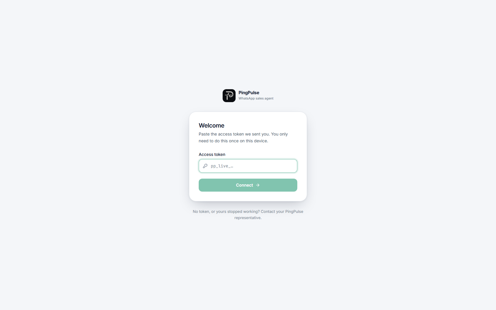

**Purpose.** There are no passwords and no sign-up. We send you one access
token; you paste it once and the app remembers it.

**How you use it.** Paste and press **Connect**. That is the whole login.

**Worth knowing.** A licence covers one person and their team, counted by
device. If you replace a machine, or run out of seats, ask us to reset them.
If the token ever stops working, contact us rather than trying another — a
wrong token will not do any damage, but it will not get you in either.

---

## 4. The screen you will live in

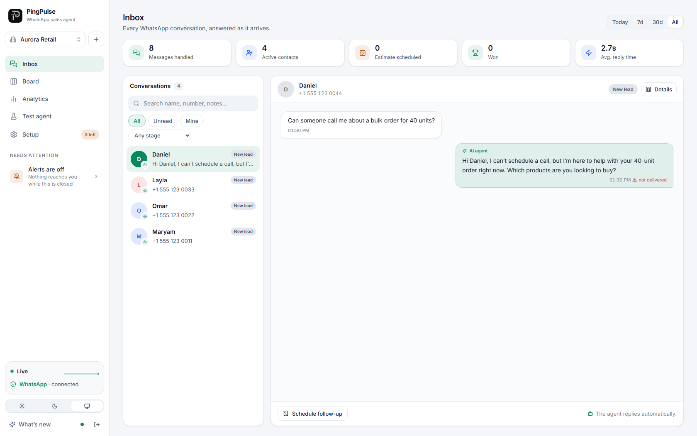

Three areas, and they do not move:

- **Across the top** — how many messages were handled, how many people are
  active, how many are booked, how many won, and how fast they were answered.
  Pick **Today**, **7 days**, **30 days** or **All time**; every number obeys
  the choice. A dash means *no answer yet*, not zero — nought out of nought
  leads is not a nought per cent conversion rate, it is a question that has
  not been asked enough times.
- **In the middle** — every conversation. Search by name, number, company or
  notes; filter by stage, unread, or the ones you have taken over. Pick one
  and it opens beside the list.
- **Down the left** — **Inbox**, **Board**, **Analytics**, **Test agent** and
  **Setup**. Anything that needs you appears underneath them under *Needs
  attention*, and **Setup** carries a count of what is still outstanding.

The business selector sits at the top of that sidebar; if you run more than
one, switching it moves everything on the screen with it. At the bottom are
your connection light, **What's new**, and a switch for light, dark or
whatever your computer is set to.

---

## 5. Setting up, step by step

**Setup** opens a page with eight steps in the order they need doing. Five are
required and three are optional, and it says which is which — a shop with no
board customisation works fine; a shop with no WhatsApp connection is not a
shop that is running.

Each step states what it is for and what happens if you skip it. The ticks are
read from the real system, so a step cannot be marked done just by visiting
it, and a business you set up on another machine already shows as done here.

### Step 1 — Your business

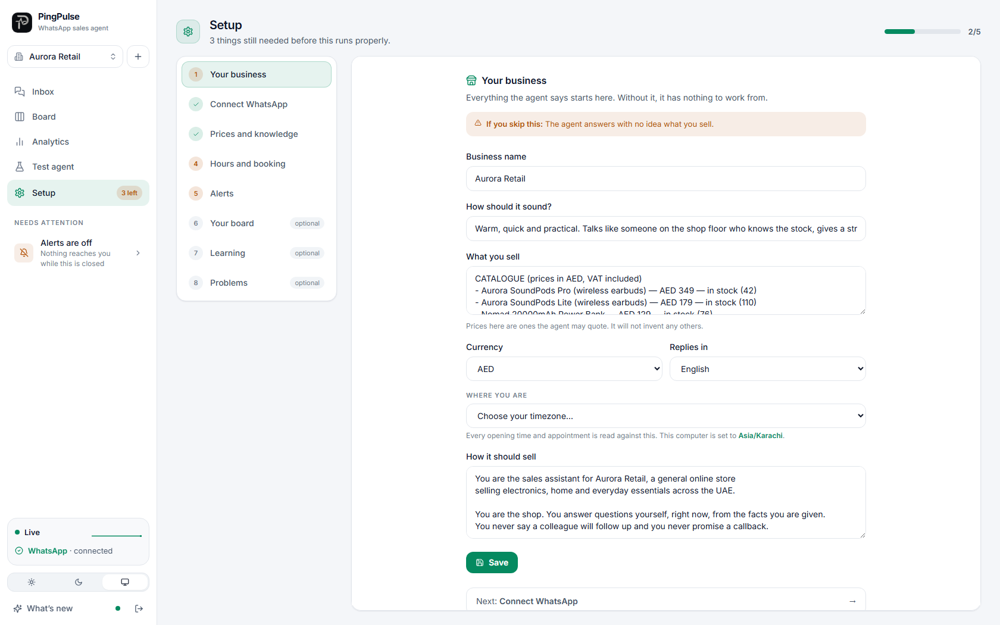

**Purpose.** Everything the agent says starts here. Without it, it has nothing
to work from.

**What you give.** Your business name, what you sell, your currency, and your
timezone — picked from a list, so nobody has to type `America/New_York` from
memory.

**If you skip it.** The agent answers with no idea what you sell.

> **Set the timezone even if nothing else.** It is the one field that quietly
> breaks other things. Hours cannot be saved without it, so booking never
> switches on — and a business that never noticed ran for months unable to
> take a single appointment.

### Step 2 — Connect WhatsApp

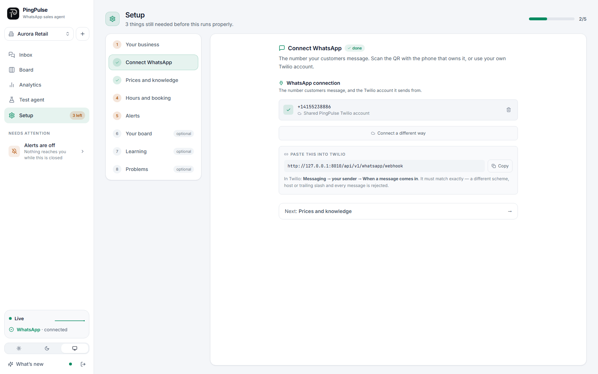

**Purpose.** The number your customers message.

**What you give.** Either the phone that owns the number — scan a QR code,
exactly like WhatsApp Web — or your own Twilio account details.

**If you skip it.** Nothing reaches you and nothing goes out. The agent is not
running.

**Worth knowing.** If you scan the QR, keep that phone online. If WhatsApp
logs the session out, the screen says so and you scan again.

### Step 3 — Prices and knowledge

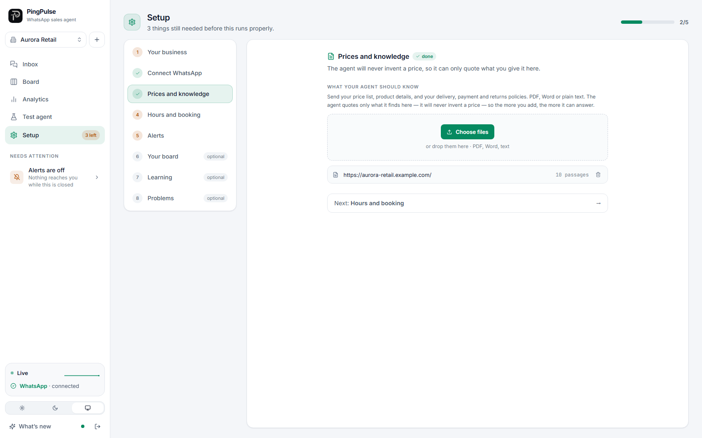

**Purpose.** The agent will never invent a price, so it can only quote what
you give it here.

**What you give.** The files you already have — a price list, a brochure, a
product sheet, a PDF, a spreadsheet, photographs of a printed list. Upload
several; they add up rather than replace each other.

**If you skip it.** It has to refuse every question about cost. It will do so
politely, but that is a demo, not a working agent.

**Worth knowing.** We show what we read back to you before it counts. If a
document also states your opening hours, we offer to fill them in — as a
suggestion you confirm, never as a silent change.

### Step 4 — Hours and booking

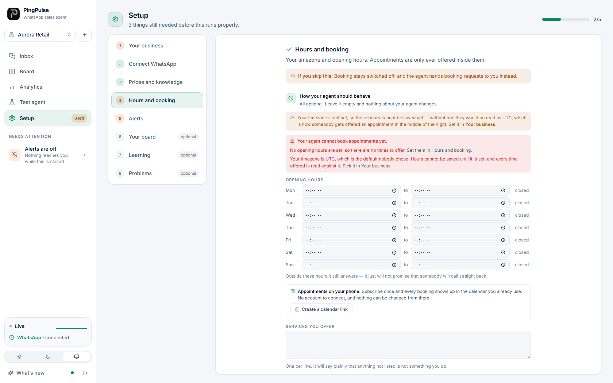

**Purpose.** Your timezone and opening hours. Appointments are only ever
offered inside them.

**What you give.** Opening and closing times per day — because "9 to 5 except
Saturdays, when we shut at 1" is what shops actually do, and one range cannot
say it.

**If you skip it.** Booking stays switched off, and the agent hands booking
requests to you instead of offering times.

**Worth knowing.** This panel tells you plainly whether your agent can take an
appointment at all, and what is stopping it — in the picture above, no hours
and an unset timezone. That message exists because a real client ran its whole
life unable to book anything and nothing anywhere said so.

**Appointments on your phone.** Press **Create a calendar link** and subscribe
to it once from your phone's calendar. Every booking then appears in the
calendar you already use — no account to connect, nothing to install, and
nothing on your phone can change a booking by accident, because the feed is
read-only.

### Step 5 — Alerts

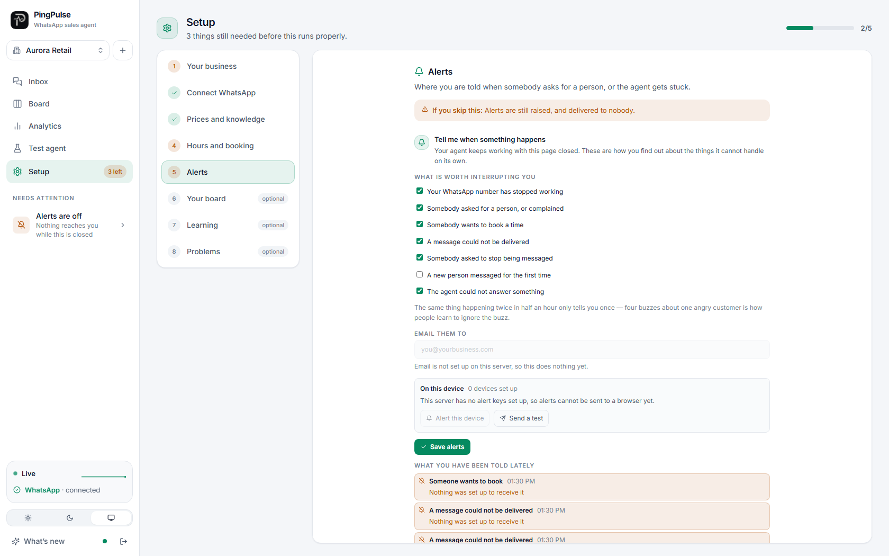

**Purpose.** Where you are told when somebody asks for a person, or when the
agent gets stuck.

**What you give.** An email address, a phone number, or both.

**If you skip it.** Alerts are still raised — and delivered to nobody.

**Worth knowing.** You can also switch on notifications for when the dashboard
is closed. The panel shows what happened to recent alerts: delivered, still
trying, failed, or raised with nowhere to go.

### Step 6 — Your board *(optional)*

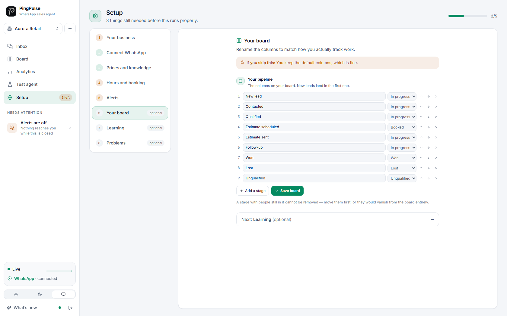

**Purpose.** Rename the columns to match how you actually track work.

**What you give.** Your own column names, in your own order. A contractor's
"Estimate sent" is their whole business and means nothing to a salon.

**If you skip it.** You keep the default columns, which is fine.

**Worth knowing.** Each column says what it counts as, so the numbers on the
dashboard follow whatever you call things. Deleting a column with people in it
is refused, and the message tells you how many are there — the useful question
is not "are you sure" but "where would those people go".

### Step 7 — Learning *(optional)*

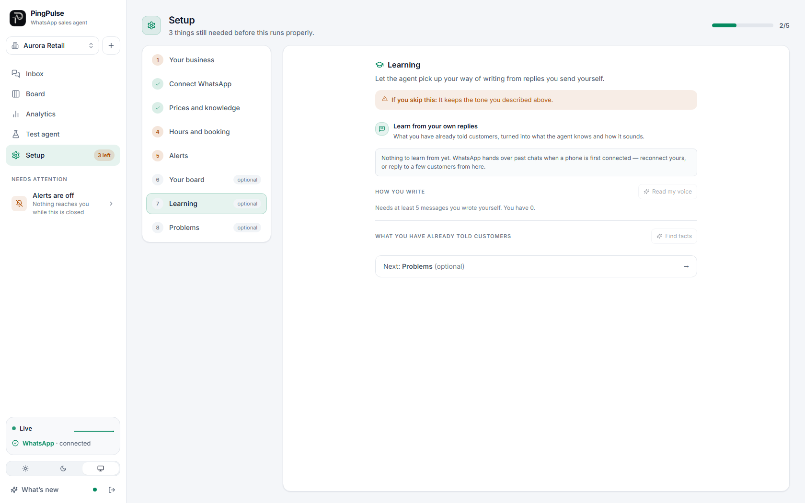

**Purpose.** Let the agent pick up your way of writing from replies you have
sent yourself.

**What you give.** Nothing new — it reads conversations you have already had.

**If you skip it.** It keeps the tone you described in step one.

**Worth knowing.** Two separate things come out of this and the screen keeps
them apart, because they fail differently. **Facts** change what the agent
believes and go into its knowledge. **Voice** changes how it sounds. Both are
drafted, shown to you, and only applied when you press the button — and the
voice is editable first, because it is your voice and you will want to correct
it. It never learns from its own replies, only from yours.

### Step 8 — Problems *(optional)*

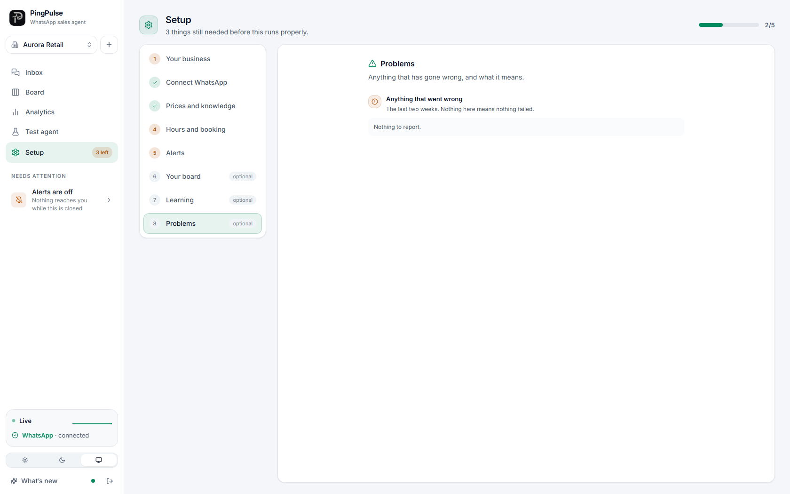

**Purpose.** Anything that has gone wrong, and what it means.

**How you use it.** Read it when something feels off. Only unresolved problems
are listed; marking one done removes it, because a log that only ever grows is
one nobody reads twice.

**Worth knowing.** The first line is written for you. The technical detail is
folded away underneath, for whoever you forward it to.

---

## 6. Using it day to day

### Conversations

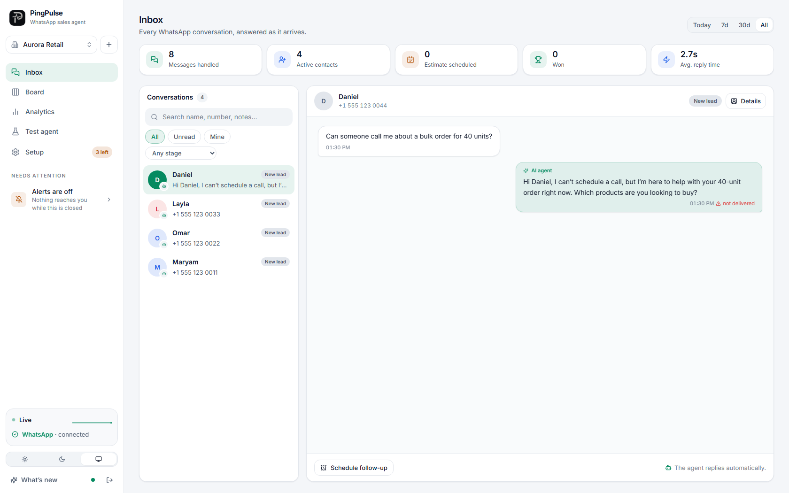

This is where most of your time goes. Every conversation is here, the agent's
replies are marked as the agent's, and yours are marked as yours.

- **Take over at any time.** Open a conversation and switch the agent off for
  that person. It stops replying to them immediately and keeps everyone else
  running.
- **The lead drawer** holds what the job actually is, what it is worth and
  what to do next — so you do not have to read sixty messages before you can
  price the work.
- **Schedule a follow-up** if somebody goes quiet. You choose whether one is
  sent at all, and nobody is messaged at three in the morning.
- **Delivery is shown honestly.** A reply that never left the building is
  not marked the same as one that is waiting on a retry.

In the picture above, the customer asked for earbuds and the agent answered
with two products, two real prices and two real stock counts — every one of
them out of the price list that was uploaded in step three. It made up
nothing, because it cannot.

### The board

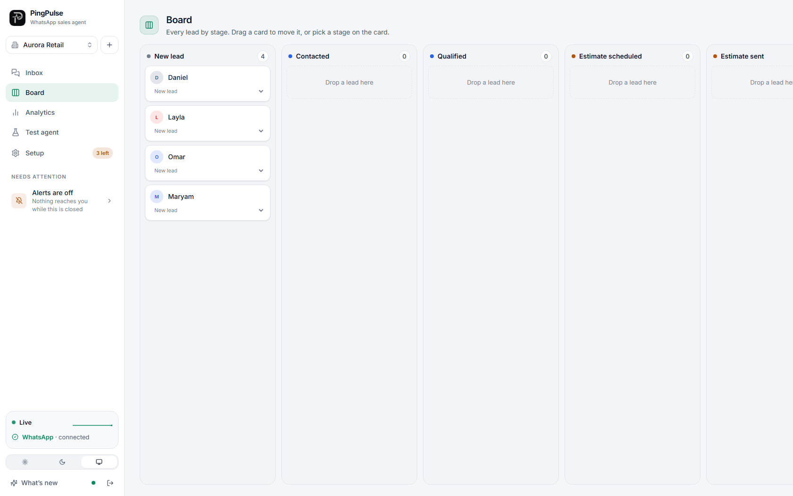

The rail on the main screen answers "where does everything stand". This is the
other half — columns side by side, wide enough to compare.

Drag a card to move someone, or use the menu on the card. Both work, which
matters because drag-and-drop does not fire on a phone at all, and a phone is
the main device for most people running this.

### Analytics

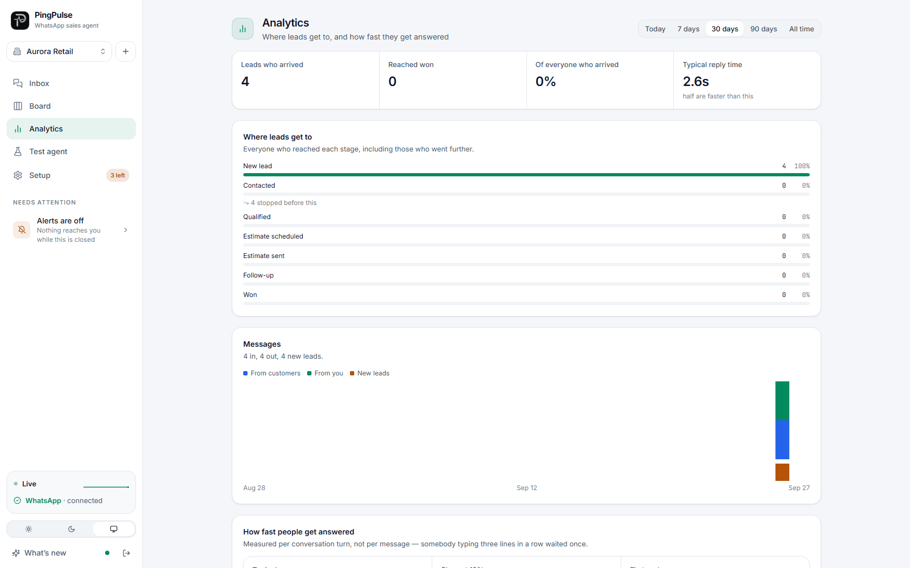

The inbox answers what is happening now. This answers how it is going: how
many got as far as qualified, where people stop replying, how fast they are
answered and by whom, and how much of the pipeline has a real figure on it.

Only leads somebody has put a number against are counted in the money, and the
screen says how many that is — so a total is never quietly built out of
guesses.

### Test agent

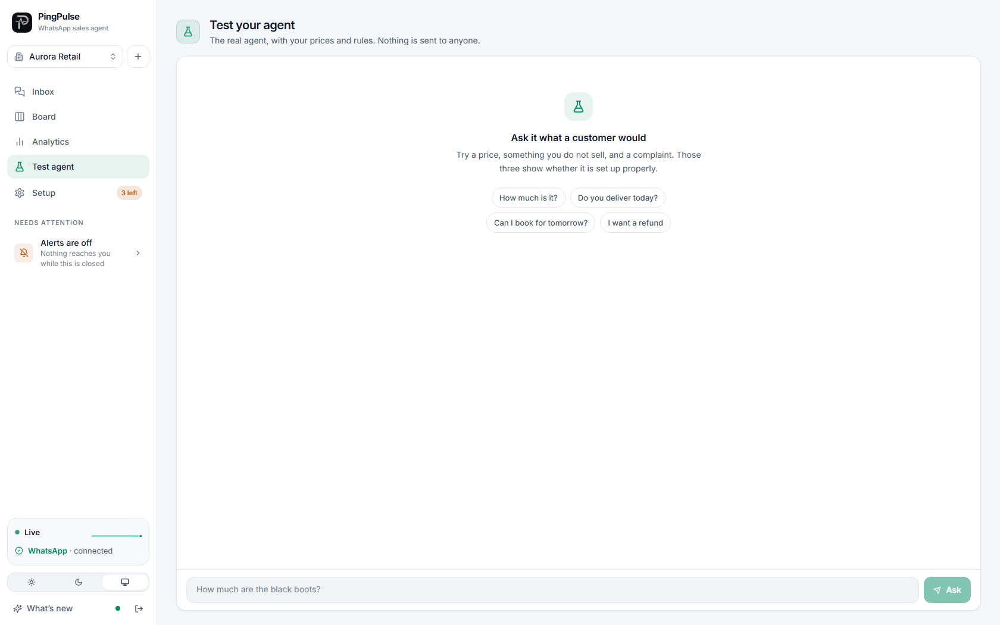

Type any message and see what the agent would say. It runs the same knowledge,
the same rules and the same prompt as the live one — with the sending removed.
Nothing reaches a customer, and no fake lead appears on your board.

It is called **Test agent** in the sidebar. Use it after you upload a price list, after you change your hours, or whenever
you want to know what it will say before it says it to somebody who matters.

If your message is one the agent would hand to a human, the sandbox shows you
that rather than inventing a smooth answer. That *is* the behaviour, and
hiding it would be a lie about what your agent does.

### What's new

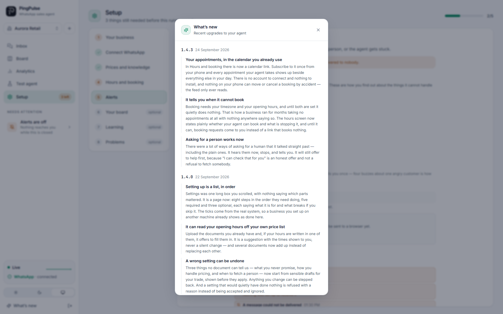

Not a changelog. Every entry is something you can see or do. The dot on the
button means there is something you have not read.

---

## 7. The rules it will not break

These are enforced in the software. They are not instructions the agent can be
talked out of.

- **It never says something happened unless it did.** No confirmed booking, no
  promised callback, no "someone will ring you in ten minutes", unless the
  system has actually recorded it.
- **It never invents a price.** If it is not in what you uploaded, it says it
  will check rather than guessing.
- **It never claims to be a person.** Asked directly, it says what it is.
- **It only offers times it can actually honour** — inside your hours, in your
  timezone, and only books a slot it already offered.
- **It answers each message once**, however many times the network delivers
  it, and sends one follow-up once.
- **It stops when somebody asks for a person**, and tells you.
- **It never messages anyone at three in the morning.**
- **It never learns from its own replies** — only from yours.

---

## 8. What we fixed recently

The honest section. These were real faults, most of them found in live
accounts.

**Booking that could never have worked.** A client's hours had been read
correctly out of a document and never confirmed, and their timezone was never
set — so booking silently stayed off, and every request to book fell through
to a calendar link that reached nobody. Not one appointment had ever been
recorded. Now the hours panel states plainly whether booking can run and what
is blocking it, and the agent hands booking requests to you rather than
offering a link that books nothing.

**Appointments now reach your phone.** Subscribe once from your phone's
calendar and every booking appears there. Read-only, no account to connect.

**"Can I speak to someone?" is now heard.** There were eighteen ways of asking
for a human that the agent talked straight past, including the plain ones. It
now recognises them and stops — while still being allowed to make an honest
offer of help, which the first version of this fix wrongly blocked.

**The duplicate follow-up storm.** One customer received forty-four identical
follow-ups in a row. Restarts during quiet hours had been stacking copies of
the same reminder, all timed to release at once. A follow-up is now claimed
before it is sent, so however many times the queue delivers the task, one
message goes out.

**Prices read out of your documents, properly.** The reader was throwing away
most of a price list — it discarded any line that looked like a sentence, and
"Wet room conversion — from $9,500" looks like a sentence. It also split
`$9,500` into two prices. Both fixed, and documents now add up instead of
replacing each other.

**A wrong setting no longer breaks the agent.** Three things no document can
tell us — what you never promise, how you handle pricing, and when to fetch a
human — are now offered as drafts for your trade, shown before they apply, and
every change can be undone. Settings that would quietly do nothing are
refused with a reason instead of accepted and ignored.

**Quieter, safer plumbing.** Some work you will never see: limits so a flood
of traffic cannot take the service down, tighter checks on the two addresses
open to the public, and a bound on how much configuration one account can
store. None of it changes your afternoon, which is why it is at the bottom of
this list.

All of this is now listed in the **What's new** panel inside the app as well,
under releases 1.3.9, 1.4.0 and 1.4.3 — so you can read it where you work
rather than only here.

---

## 9. If something goes wrong

1. Open **Setup → Problems**. Most things that break say so there, in plain
   words.
2. Check **Setup → Connect WhatsApp**. If the phone that owns the number has
   been logged out, nothing arrives and nothing sends.
3. Check **Setup → Alerts**. If alerts have nowhere to go, you will not have
   been told.
4. Use **Test agent** to reproduce it safely before changing anything.

If it is still wrong, send us what **Problems** shows — including the folded
technical detail — and the time it happened.
